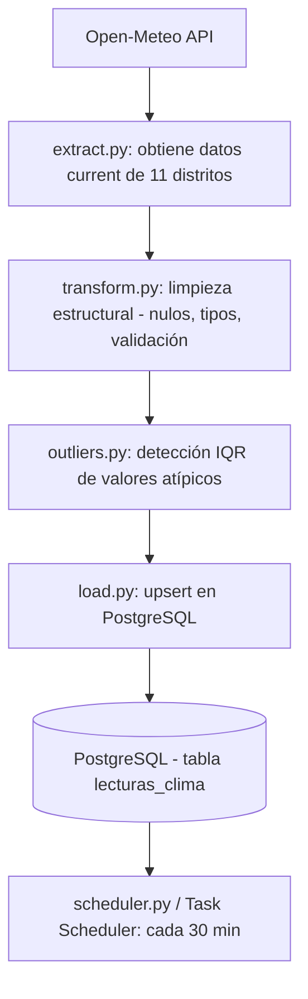

# ClimaIca_Live

Pipeline ETL en tiempo real que monitorea temperatura, humedad, viento y precipitación en los 11 distritos de la provincia de Ica, Perú — región que concentra el 32% de los fundos agrícolas del departamento.

## Motivación

Ica es una de las zonas agroexportadoras más importantes del Perú. Contar con datos climáticos actualizados y desagregados por distrito puede ser útil para decisiones operativas (riego, cosecha, logística) en negocios agrícolas de la región.

Este proyecto simula el tipo de pipeline que una empresa del sector podría necesitar: extracción automatizada de una fuente externa, limpieza y validación de datos, detección de valores atípicos, y almacenamiento estructurado para análisis posterior.

## Arquitectura



## Stack técnico

- **Python 3.13** — extracción, transformación y carga
- **PostgreSQL 16 (Docker)** — almacenamiento
- **Open-Meteo API** — fuente de datos climáticos, sin necesidad de API key
- **psycopg2** — conexión a PostgreSQL
- **APScheduler** — automatización de la ejecución periódica
- **NumPy** — cálculo de cuartiles para detección de outliers

## Estructura de datos

| Campo | Tipo | Descripción |
|---|---|---|
| distrito | VARCHAR | Uno de los 11 distritos de la provincia de Ica |
| fecha_hora | TIMESTAMP | Hora del dato reportado por Open-Meteo |
| temperatura | NUMERIC | °C |
| humedad_relativa | NUMERIC | % |
| velocidad_viento | NUMERIC | km/h |
| precipitacion | NUMERIC | mm |
| temp_es_outlier | BOOLEAN | Marca si la temperatura se aleja del rango histórico (IQR) |

## Cómo correrlo

```bash
git clone https://github.com/Gleizits/ClimaIca_Live.git
cd ClimaIca_Live
python -m venv venv
venv\Scripts\activate
pip install -r requirements.txt

# Levantar PostgreSQL en Docker
docker run --name pg-clima -e POSTGRES_PASSWORD=tu_password -p 5432:5432 -d postgres

# Configurar .env con tus credenciales (ver .env.example)

python main.py
```

## Sobre el uso de IA en este proyecto

Este proyecto fue desarrollado con apoyo de IA (Claude) como herramienta de diseño y generación de código, bajo mi dirección y revisión constante.

No lo veo como un atajo, sino como un reflejo de hacia dónde creo que va nuestra profesión. Así como un ingeniero civil no coloca cada ladrillo, sino que diseña la estructura, elige los materiales y supervisa que la obra cumpla los estándares, creo que el rol de programadores e ingenieros de software está migrando hacia algo similar: **definir la arquitectura, elegir las herramientas correctas, y validar que el resultado cumpla los requisitos técnicos y de negocio** — más que escribir cada línea de código manualmente.

En este proyecto, yo:
- Definí el problema de negocio y el alcance
- Diseñé la arquitectura del pipeline (ETL, no ELT, y por qué)
- Elegí las fuentes de datos, evaluando alternativas (Open-Meteo vs. OpenWeather vs. NASA)
- Tomé decisiones técnicas clave (upsert vs. duplicados, IQR para outliers, estructura de la BD)
- Revisé, probé y depuré cada componente del código generado

Creo que ser explícito sobre esto es más honesto — y más valioso para quien revise este repo — que pretender que cada línea salió de cero sin ayuda.

## 📌 Próximos pasos

- [ ] Dashboard de visualización
- [ ] Ampliar el histórico para validar la detección de outliers con datos reales
- [ ] Migrar la BD a un servicio cloud gratuito (Neon/Supabase) para automatizar con GitHub Actions
